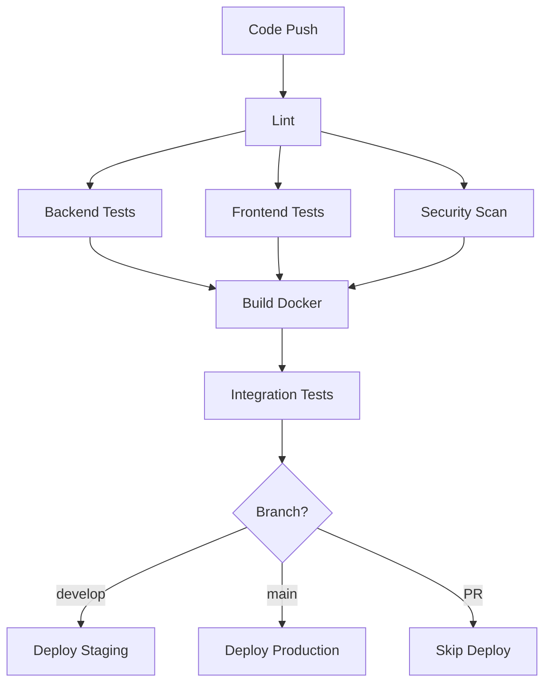

# AI Gateway - CI/CD Documentation

## Overview

This project uses GitHub Actions for continuous integration and deployment. The CI/CD pipeline ensures code quality, runs tests, and automates deployments.

## Workflows

### 1. CI/CD Pipeline (`ci.yml`)

**Triggers:**
- Push to `main` or `develop` branches
- Pull requests to `main` or `develop`
- Release creation

**Jobs:**

#### Code Quality
- **Lint** - Runs golangci-lint and checks Go formatting
- **Security Scan** - Runs Gosec and Trivy vulnerability scanners

#### Tests
- **Backend Tests** - Unit tests with coverage report
- **Frontend Tests** - Lint, test, and build

#### Build & Deploy
- **Build Docker Images** - Builds and pushes to GitHub Container Registry
- **Integration Tests** - Tests with Docker Compose
- **Deploy to Staging** - Auto-deploy on develop branch
- **Deploy to Production** - Auto-deploy on release

### 2. Release Workflow (`release.yml`)

**Triggers:**
- Push tags matching `v*.*.*`

**Features:**
- Generates changelog automatically
- Builds binaries for multiple platforms (Linux, macOS, Windows)
- Creates GitHub release with artifacts
- Pushes Docker images with version tags
- Updates VERSION file

### 3. Dependency Updates (`maintenance.yml`)

**Triggers:**
- Weekly schedule (Monday 9 AM UTC)
- Manual trigger

**Features:**
- Checks for outdated dependencies
- Runs security audit
- Creates automated PR for updates

### 4. Docker Build (`docker-build.yml`)

**Triggers:**
- Manual workflow dispatch

**Features:**
- Build images for multiple platforms (amd64, arm64)
- Optional push to registry
- Automated testing

## Setup Instructions

### 1. Required Secrets

No additional secrets required! The workflow uses `GITHUB_TOKEN` which is automatically provided.

### 2. Required Settings

#### Enable GitHub Packages
1. Go to repository Settings → Actions → General
2. Under "Workflow permissions", select "Read and write permissions"
3. Check "Allow GitHub Actions to create and approve pull requests"

#### Branch Protection Rules
1. Go to Settings → Branches
2. Add rule for `main` branch
3. Enable:
   - Require status checks to pass before merging
   - Require branches to be up to date before merging
   - Status checks: `lint`, `test-backend`, `test-frontend`

### 3. Environment Configuration

#### Staging Environment
1. Go to Settings → Environments
2. Create `staging` environment
3. Add required reviewers (optional)
4. Add environment secrets (if needed)

#### Production Environment
1. Create `production` environment
2. Add required reviewers (recommended)
3. Add environment secrets:
   - `DEPLOY_KEY` (for SSH deployment)
   - `DEPLOY_HOST` (production server)
   - `DEPLOY_USER` (deployment user)

## Usage

### Create a Release

```bash
# Create and push a tag
git tag v1.0.0
git push origin v1.0.0

# This will:
# 1. Run all tests
# 2. Build binaries for all platforms
# 3. Build and push Docker images
# 4. Create GitHub release
# 5. Deploy to production
```

### Manual Docker Build

1. Go to Actions → Docker Build
2. Click "Run workflow"
3. Select options:
   - Push to registry: Yes/No
   - Image tag: custom-tag (optional)
4. Click "Run workflow"

### Check Dependencies

1. Go to Actions → Dependency Updates
2. Click "Run workflow"
3. This will create a PR if updates are available

## Pipeline Stages



## Code Coverage

Coverage reports are uploaded to Codecov automatically.

- Backend coverage: `coverage.out`
- Frontend coverage: `web/coverage/`

View coverage at: https://codecov.io/gh/[org]/[repo]

## Docker Images

### Image Locations

- Gateway: `ghcr.io/[org]/ai-gateway:[tag]`
- Web: `ghcr.io/[org]/ai-gateway-web:[tag]`

### Available Tags

- `latest` - Latest stable release
- `v1.0.0` - Specific version
- `sha-abc123` - Git commit SHA
- `dev` - Development build

### Pull Images

```bash
# Pull latest
docker pull ghcr.io/[org]/ai-gateway:latest

# Pull specific version
docker pull ghcr.io/[org]/ai-gateway:v1.0.0
```

## Deployment

### Staging Deployment

**Trigger:** Push to `develop` branch

**Steps:**
1. Tests pass
2. Docker images built
3. Deploy to staging environment
4. URL: https://staging.ai-gateway.example.com

### Production Deployment

**Trigger:** Release creation

**Steps:**
1. Tests pass
2. Docker images built with version tag
3. Create GitHub release
4. Deploy to production environment
5. URL: https://ai-gateway.example.com

### Manual Deployment

If automatic deployment fails, you can deploy manually:

```bash
# SSH to server
ssh user@server

# Pull latest images
cd /app/ai-gateway
docker compose -f deploy/docker-compose.prod.yml pull

# Restart services
docker compose -f deploy/docker-compose.prod.yml up -d

# Check logs
docker compose -f deploy/docker-compose.prod.yml logs -f
```

## Troubleshooting

### Failed Tests

1. Check the Actions log
2. Run tests locally:
   ```bash
   # Backend
   go test ./...

   # Frontend
   cd web && npm test
   ```

### Failed Docker Build

1. Check Dockerfile syntax
2. Build locally:
   ```bash
   docker build -t test .
   ```

### Failed Deployment

1. Check environment secrets
2. Check server logs
3. Verify network connectivity
4. Run health checks manually

## Best Practices

### Commit Messages

Use conventional commits for better changelog:

```
feat: add new provider support
fix: resolve cache issue
docs: update deployment guide
chore: update dependencies
```

### Branch Strategy

- `main` - Production-ready code
- `develop` - Integration branch
- `feature/*` - New features
- `fix/*` - Bug fixes

### Release Process

1. Create PR to `main`
2. Ensure all checks pass
3. Merge PR
4. Create tag: `git tag v1.0.0`
5. Push tag: `git push origin v1.0.0`
6. Monitor release workflow
7. Verify deployment

## Monitoring

### Workflow Status

Add status badges to README:

```markdown
[](https://github.com/[org]/[repo]/actions/workflows/ci.yml)
[](https://github.com/[org]/[repo]/actions/workflows/release.yml)
```

### Notifications

Configure notifications in repository Settings → Notifications:
- Email notifications
- Slack integration
- Custom webhooks

## Security

### Vulnerability Scanning

- Trivy scans filesystem
- Gosec scans Go code
- npm audit scans dependencies

### Secret Management

- Never commit secrets
- Use GitHub Secrets
- Use environment-specific secrets

### Access Control

- Limit write access to repository
- Require PR reviews
- Use branch protection rules

## Support

For CI/CD issues:
1. Check Actions logs
2. Review this documentation
3. Check GitHub Actions status
4. Contact DevOps team
